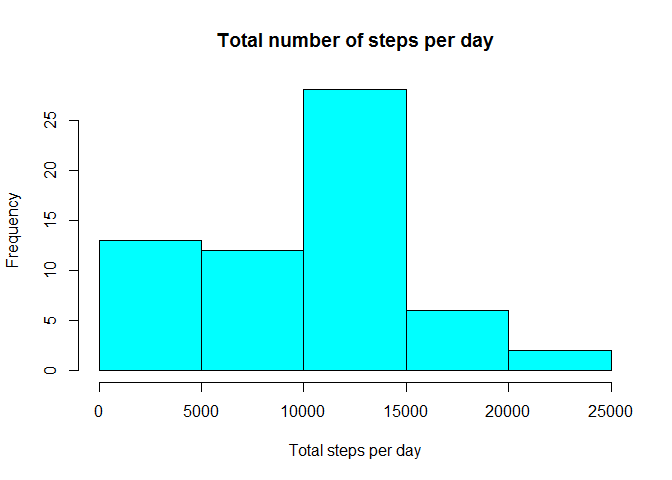
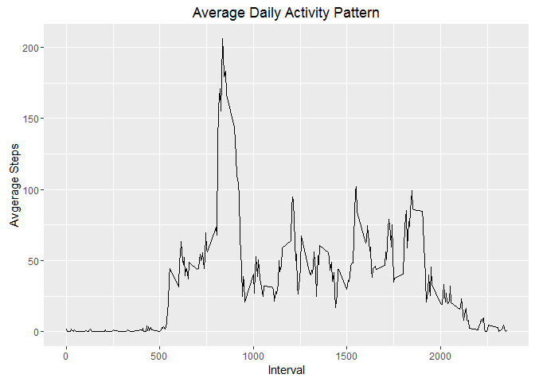
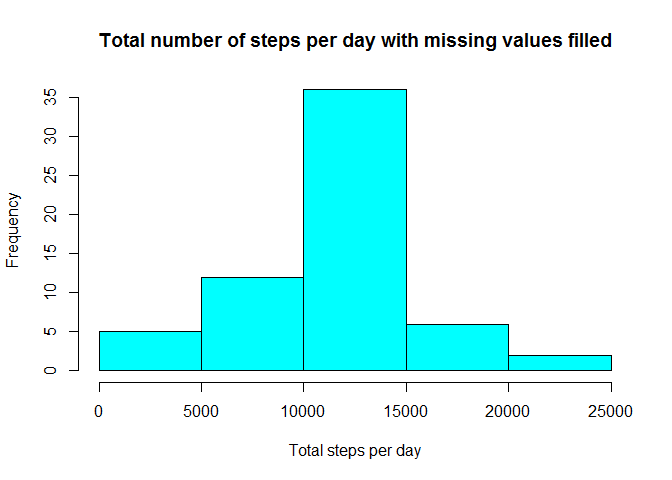
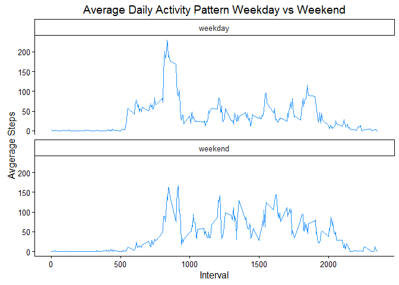

# Reproducible Research: Peer Assessment 1

## Loading and preprocessing the data


```r
library(dplyr)
library(ggplot2)
library(lubridate)
rawdat <- read.csv('activity.csv')
rawdat$date <- as.Date(rawdat$date)
```

## Histogram of the total number of steps taken each day


```r
bydate <- rawdat %>% group_by(date) %>% summarize(totSteps=sum(steps, na.rm=TRUE))
hist(bydate$totSteps, col=5, main="Total number of steps per day", xlab="Total steps per day")
```



## What is mean and median total number of steps taken per day?


```r
mean(bydate$totSteps, na.rm=TRUE)
```

```
## [1] 9354.23
```

```r
median(bydate$totSteps, na.rm=TRUE)
```

```
## [1] 10395
```

## What is the average daily activity pattern?


```r
avgday <- rawdat %>% group_by(interval) %>% summarize(steps=mean(steps, na.rm=TRUE))
ggplot(avgday, aes(x=interval, y=steps))+geom_line()+labs(title="Average Daily Activity Pattern",x="Interval",y="Avgerage Steps")
```



## Which 5-minute interval, on average across all the days in the dataset, contains the maximum number of steps?


```r
avgday[avgday$steps == max(avgday$steps,na.rm=TRUE),]$interval
```

```
## [1] 835
```

## Imputing missing values

### How many rows have NA values


```r
sum(is.na(rawdat$steps))
```

```
## [1] 2304
```

### Fill in missing values with mean for 5-min interval


```r
m <- merge(rawdat, avgday, by='interval', all.x=TRUE)
fixdat <- m %>% mutate(steps = ifelse(is.na(steps.x), steps.y, steps.x)) %>% select(date,interval,steps)
```

### Histogram of total number of steps with missing values filled.


```r
fixbydate <- fixdat %>% group_by(date) %>% summarize(totSteps=sum(steps))
hist(fixbydate$totSteps, col=5, main="Total number of steps per day with missing values filled", xlab="Total steps per day")
```



### Mean and median of total steps taken per day with missing values filled.


```r
mean(fixbydate$totSteps)
```

```
## [1] 10766.19
```

```r
median(fixbydate$totSteps)
```

```
## [1] 10766.19
```


## Are there differences in activity patterns between weekdays and weekends?


```r
fixdat <- fixdat %>% mutate(weekday=as.factor(ifelse(grepl("^S", weekdays(date)),"weekend","weekday")))

fixavgweekday <- fixdat %>% group_by(weekday,interval) %>% summarize(steps=mean(steps))

ggplot(fixavgweekday, aes(x=interval, y=steps,))+facet_wrap(~weekday,ncol=1)+geom_line(col="dodgerblue")+labs(title="Average Daily Activity Pattern Weekday vs Weekend",x="Interval",y="Avgerage Steps")+theme_classic()
```


